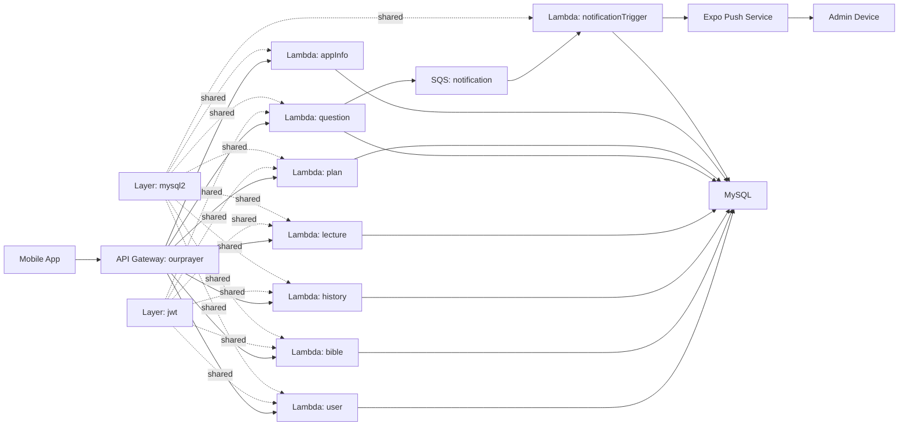
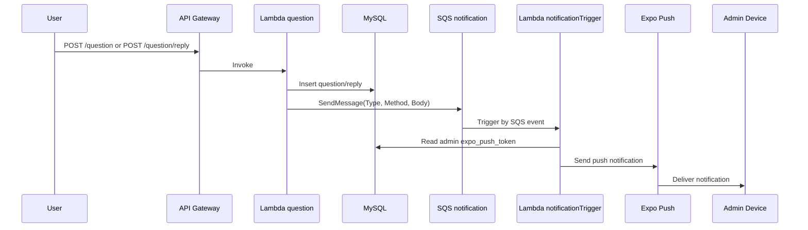

# Our Prayer Server

실사용 기도/묵상 앱의 백엔드 서버입니다.

- 운영 기간: 약 2년
- MAU: 100+
- 주요 기술: AWS Serverless, Node.js 22, MySQL, SQS, Expo Push

## 1. 프로젝트 개요

모바일 앱의 핵심 사용자 흐름(인증, 플랜/강의 조회, 기도 기록, 질문/답변)을 안정적으로 제공하는 서버를 설계하고 운영했습니다.

주요 기능:
- 사용자 인증 및 세션 관리
- 기도 플랜/강의/오디오 조회
- 기도 기록 저장 및 상세 조회
- 질문/답변 기능과 관리자 푸시 알림

## 2. 시스템 아키텍처

### 2.1 구성 요약

- API Gateway: `ourprayer` 1개
- Lambda Function: 8개
  - `user`, `bible`, `history`, `lecture`, `question`, `plan`, `appInfo`, `notificationTrigger`
- Lambda Layer: 2개
  - `jwt`, `mysql2`
- Queue: SQS `notification` 1개
- Runtime: `nodejs22.x`, `arm64`
- API 엔드포인트: 30개

관련 코드 위치:
- `template.yml`

### 2.2 아키텍처 다이어그램

### 2.3 질문/답변 알림 시퀀스

관련 코드 위치:
- `function/question/question.ts`
- `function/question/reply.ts`
- `function/notificationTrigger/handler.ts`
- `function/notificationTrigger/pushServer.ts`

## 3. 비용 절감 인프라 진화

운영 비용을 줄이기 위해 인프라를 단계적으로 전환했습니다.

`RDS -> EC2 + Docker + MySQL -> 온프레미스 (Raspberry Pi 5) + MySQL`

### 3.1 전환 타임라인

1. 1단계: RDS
2. 2단계: EC2 + Docker + MySQL
3. 3단계: 온프레미스 (Raspberry Pi 5) + MySQL

### 3.2 일평균 비용 비교 (KRW/일)

비교 기준은 `일 평균 비용`입니다.
EC2 구간은 월평균 비용 산정이 어려워, 단계 간 동일 기준 비교를 위해 일평균 기준으로 통일했습니다.

| 단계 | 기준 기간 | 일평균 비용 | 직전 단계 대비 증감 | 전환 이유 | 리스크/대응 | 근거 자료 |
| --- | --- | --- | --- | --- | --- | --- |
| RDS | 미수집 | 미수집 | - | 운영비 절감 필요성 확인 | 미수집 | 프로젝트 운영 기록 |
| EC2 + Docker + MySQL | 미수집 | 미수집 | 미수집 | DB 운영비 절감 시도 | 미수집 | 프로젝트 운영 기록, blog-01 |
| 온프레미스 (Raspberry Pi 5) + MySQL | 미수집 | 미수집 | 미수집 | 추가 비용 절감 | 미수집 | 프로젝트 운영 기록, blog-02 |

## 4. 핵심 구현 딥다이브

### 4.1 인증 및 토큰 재발급

핵심 동작:
1. 회원 등록 시 `user`, `user_state`, `refresh_token`를 트랜잭션으로 생성
2. Access Token 만료시간은 `1h`
3. 보호 API에서 Access Token 검증 실패 시 Refresh Token으로 재발급 시도
4. 재발급 성공 시 `401` 응답에 새 `accessToken` 포함

관련 코드 위치:
- `function/user/auth/register.ts`
- `layer/jwt/customJwt/index.ts`
- `function/user/user.ts`

### 4.2 질문/답변 비동기 알림 파이프라인

핵심 동작:
1. 질문/답변 생성 후 SQS 메시지 발행
2. 메시지 속성 `Type(question|reply)`, `Method(insert)` 사용
3. `notificationTrigger`가 SQS 이벤트를 소비
4. 관리자 `expo_push_token` 조회 후 Expo Push 발송

관련 코드 위치:
- `function/question/question.ts`
- `function/question/reply.ts`
- `function/notificationTrigger/handler.ts`
- `function/notificationTrigger/question.ts`
- `function/notificationTrigger/reply.ts`
- `function/notificationTrigger/pushServer.ts`

### 4.3 플랜/강의/오디오/기록 조회 모델

핵심 동작:
1. `/plan`에서 플랜 목록과 최근 기도 이력 기반 `currentPlan` 제공
2. `/lecture/audio`에서 강의별 오디오를 그룹화해 반환
3. `/history`, `/history/detail`에서 기도 기록 CRUD/상세 조회 제공

관련 코드 위치:
- `function/plan/plan.tsx`
- `function/lecture/lectureAudio.ts`
- `function/history/history.ts`
- `function/history/detail.ts`

## 5. 데이터 모델 (ERD)

핵심 테이블:
- `user`, `user_state`, `refresh_token`
- `question`, `question_reply`
- `plan`, `lecture`
- `prayer_history`

관계 요약:
- `user` 1:1 `user_state`
- `user` 1:N `refresh_token`
- `user` 1:N `question`
- `question` 1:N `question_reply`
- `plan` 1:N `lecture`
- `user` 1:N `prayer_history`, `lecture` 1:N `prayer_history`

### ERD 이미지 슬롯 1 (전체 관계도)

### ERD 이미지 슬롯 2 (질문/답변 도메인)

## 6. API 부록

`template.yml` 기준으로 정의된 엔드포인트입니다.

### 6.1 User

| Method | Path | Auth | Function |
| --- | --- | --- | --- |
| POST | `/user/auth` | No | `user` |
| GET | `/user` | Yes | `user` |
| PUT | `/user` | Yes | `user` |
| DELETE | `/user` | Yes | `user` |

### 6.2 Bible

| Method | Path | Auth | Function |
| --- | --- | --- | --- |
| GET | `/bible` | Yes | `bible` |

### 6.3 History

| Method | Path | Auth | Function |
| --- | --- | --- | --- |
| GET | `/history` | Yes | `history` |
| POST | `/history` | Yes | `history` |
| PUT | `/history` | Yes | `history` |
| DELETE | `/history` | Yes | `history` |
| GET | `/history/detail` | Yes | `history` |
| POST | `/history/detail` | Yes | `history` |
| DELETE | `/history/detail` | Yes | `history` |

### 6.4 Lecture

| Method | Path | Auth | Function |
| --- | --- | --- | --- |
| GET | `/lecture` | Yes | `lecture` |
| POST | `/lecture` | Yes | `lecture` |
| GET | `/lecture/audio` | Yes | `lecture` |
| POST | `/lecture/user/audio` | Yes | `lecture` |
| GET | `/lecture/userAudio` | Yes | `lecture` |
| POST | `/lecture/userAudio` | Yes | `lecture` |

### 6.5 Plan

| Method | Path | Auth | Function |
| --- | --- | --- | --- |
| GET | `/plan` | Yes | `plan` |
| GET | `/plan/user` | Yes | `plan` |
| POST | `/plan/user` | Yes | `plan` |
| DELETE | `/plan/user` | Yes | `plan` |

### 6.6 Question

| Method | Path | Auth | Function |
| --- | --- | --- | --- |
| GET | `/question` | Yes | `question` |
| POST | `/question` | Yes | `question` |
| PUT | `/question` | Yes | `question` |
| DELETE | `/question` | Yes | `question` |
| GET | `/question/reply` | Yes | `question` |
| POST | `/question/reply` | Yes | `question` |

### 6.7 App Info / Notice

| Method | Path | Auth | Function |
| --- | --- | --- | --- |
| GET | `/appInfo` | No | `appInfo` |
| GET | `/appNotice` | No | `appInfo` |

### 6.8 이벤트 인터페이스 (SQS)

| 항목 | 타입 | 값 |
| --- | --- | --- |
| Message Attribute `Type` | String | `question` or `reply` |
| Message Attribute `Method` | String | `insert` |
| Message Body | JSON string | `{"user_id":"..."}` |

## 7. 회고 및 개선 계획

### 7.1 현재 한계

1. 엔드포인트/인증 처리 로직이 함수별로 반복됩니다.
2. 저장소 기준 자동화 테스트 코드가 없습니다.
3. 비용 비교 수치와 블로그 URL, 앱스토어 URL은 아직 미입력 상태입니다.

### 7.2 다음 단계

1. 인증/응답 포맷 공통 모듈화
2. 핵심 사용자 플로우 통합 테스트 추가
3. 비용 실측치, 블로그 링크, ERD 이미지 반영 완료

## 8. 외부 링크

### 8.1 앱 스토어

- iOS: 미수집
- Android: 미수집

### 8.2 비용 절감 관련 블로그

- blog-01: RDS -> EC2 + Docker + MySQL 전환 배경/실행 (URL 미수집)
- blog-02: EC2 -> 온프레미스 (Raspberry Pi 5) 전환 배경/실행 (URL 미수집)
- blog-03: 비용/운영 회고 (URL 미수집)

## 9. 참고 코드 인덱스

- 인프라/엔드포인트 정의: `template.yml`
- 배포/빌드 설정: `samconfig.toml`
- 인증 계층: `layer/jwt/customJwt/index.ts`
- DB 계층: `layer/mysql2/customMysql/index.ts`
- 질문/답변 + SQS 발행: `function/question/question.ts`, `function/question/reply.ts`
- SQS 소비 + Push 발송: `function/notificationTrigger/handler.ts`, `function/notificationTrigger/pushServer.ts`
- 플랜/강의/기록: `function/plan/plan.tsx`, `function/lecture/lectureAudio.ts`, `function/history/history.ts`
