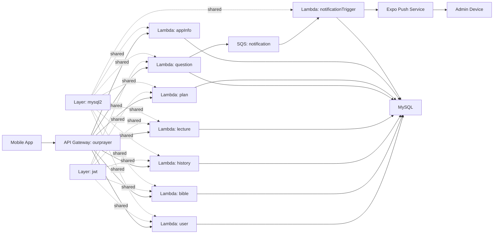
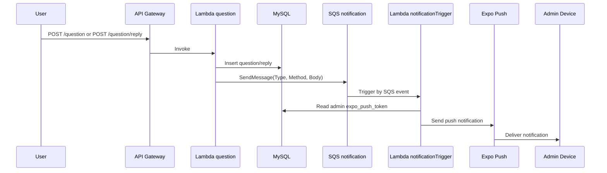

# Our Prayer Server

실사용 기도/묵상 앱 백엔드 서버 포트폴리오 문서입니다.

- 운영 기간: 약 2년 `[운영근거]`
- MAU: `100+` `[운영근거]`
- 아키텍처: `AWS Serverless + MySQL` `[코드근거] /template.yml`

## 문서 원칙

이 문서는 사실 검증이 가능한 정보만 기록합니다.

- `[코드근거]`: 저장소 코드로 확인 가능한 사실
- `[운영근거]`: 실제 운영 데이터/기록
- `[외부근거]`: 블로그/외부 공개 링크

수치가 확보되지 않은 항목은 `미수집`으로 명시합니다.

## 1. 문제와 목표

이 서버는 모바일 앱의 기도/묵상 흐름을 지원하는 API 백엔드입니다.

- 사용자 인증/세션 관리
- 기도 플랜/강의/오디오 조회
- 기도 기록(history) 저장 및 상세 조회
- 질문/답변 기능과 관리자 알림

`[코드근거]` `/function/*`, `/template.yml`

## 2. 시스템 아키텍처

### 2.1 구성 요약

- API Gateway: 1개 (`ourprayer`)
- Lambda Function: 8개 (`user`, `bible`, `history`, `lecture`, `question`, `plan`, `appInfo`, `notificationTrigger`)
- Lambda Layer: 2개 (`jwt`, `mysql2`)
- Queue: SQS 1개 (`notification`)
- Runtime: `nodejs22.x`, `arm64`
- 정의된 API 엔드포인트: 30개

`[코드근거]` `/template.yml`

### 2.2 아키텍처 다이어그램

### 2.3 질문/답변 알림 시퀀스

`[코드근거]` `/function/question/question.ts`, `/function/question/reply.ts`, `/function/notificationTrigger/handler.ts`, `/function/notificationTrigger/pushServer.ts`

## 3. 비용 절감 인프라 진화

목표는 동일 서비스 운영을 유지하면서 인프라 비용을 절감하는 것이었습니다.  
전환 순서는 아래와 같습니다.

`RDS -> EC2 + Docker + MySQL -> 온프레미스 (Raspberry Pi 5) + MySQL`

`[운영근거]` 프로젝트 운영 기록

### 3.1 전환 타임라인

1. 1단계: `RDS`
2. 2단계: `EC2 + Docker + MySQL`
3. 3단계: `온프레미스 (Raspberry Pi 5) + MySQL`

### 3.2 일평균 비용 비교표 (KRW/일)

비교 기준은 `일 평균 비용`입니다.  
사유: EC2 구간에서 월 평균 비용 산정이 어려워, 동일 기준으로 일평균을 사용했습니다.

| 단계 | 기준 기간 | 일평균 비용 (KRW/일) | 직전 단계 대비 증감 | 전환 이유 | 리스크/대응 | 근거 |
| --- | --- | --- | --- | --- | --- | --- |
| RDS | 미수집 | 미수집 | - | 운영비 절감 필요성 확인 | 미수집 | `[운영근거]` |
| EC2 + Docker + MySQL | 미수집 | 미수집 | 미수집 | DB 운영비 절감 시도 | 미수집 | `[운영근거]`, `[외부근거] blog-01` |
| 온프레미스 (Raspberry Pi 5) + MySQL | 미수집 | 미수집 | 미수집 | 추가 비용 절감 | 미수집 | `[운영근거]`, `[외부근거] blog-02` |

## 4. 핵심 구현 딥다이브

### 4.1 인증/토큰 재발급

핵심 동작:

1. 회원 등록 시 `user`, `user_state`, `refresh_token`를 트랜잭션으로 생성
2. Access Token 만료시간은 `1h`
3. 보호 API에서 Access Token 검증 실패 시 Refresh Token으로 재발급 시도
4. 재발급 성공 시 `401` 응답에 새 accessToken 포함

`[코드근거]` `/function/user/auth/register.ts`, `/layer/jwt/customJwt/index.ts`, `/function/user/user.ts`

### 4.2 질문/답변 비동기 알림 파이프라인

핵심 동작:

1. 질문/답변 생성 시 DB 반영 후 SQS 메시지 발행
2. 메시지 속성 `Type(question|reply)`, `Method(insert)` 사용
3. `notificationTrigger`가 SQS 이벤트를 소비
4. 관리자 `expo_push_token` 조회 후 Expo Push 발송

`[코드근거]` `/function/question/question.ts`, `/function/question/reply.ts`, `/function/notificationTrigger/handler.ts`, `/function/notificationTrigger/question.ts`, `/function/notificationTrigger/reply.ts`, `/function/notificationTrigger/pushServer.ts`

### 4.3 플랜/강의/오디오/기록 조회 모델

핵심 동작:

1. `/plan`은 플랜 목록과 최근 기도 이력 기반 `currentPlan` 제공
2. `/lecture/audio`는 강의별 오디오를 그룹화해서 반환
3. `/history`, `/history/detail`은 기도 기록 CRUD/상세 조회 제공

`[코드근거]` `/function/plan/plan.tsx`, `/function/lecture/lectureAudio.ts`, `/function/history/history.ts`, `/function/history/detail.ts`

## 5. 데이터 모델 (ERD)

핵심 테이블(요청 기준):

- `user`, `user_state`, `refresh_token`
- `question`, `question_reply`
- `plan`, `lecture`
- `prayer_history`

관계 요약:

- `user` 1:1 `user_state`
- `user` 1:N `refresh_token`
- `user` 1:N `question`
- `question` 1:N `question_reply`
- `plan` 1:N `lecture`
- `user` 1:N `prayer_history`, `lecture` 1:N `prayer_history`

`[코드근거]` 각 도메인 SQL 쿼리 (`/function/*`)

### ERD 이미지 슬롯 1 (전체 관계도)

- 파일 경로(예약): `docs/images/erd-overview.png`
- 캡션(예시): 핵심 도메인 테이블의 전체 관계

### ERD 이미지 슬롯 2 (질문/답변 도메인)

- 파일 경로(예약): `docs/images/erd-question-reply.png`
- 캡션(예시): 질문/답변/사용자 관계 상세

## 6. API 부록

아래 표는 `template.yml` 기준으로 정의된 엔드포인트입니다.

### 6.1 User

| Method | Path | Auth | Function |
| --- | --- | --- | --- |
| POST | `/user/auth` | No | `user` |
| GET | `/user` | Yes | `user` |
| PUT | `/user` | Yes | `user` |
| DELETE | `/user` | Yes | `user` |

### 6.2 Bible

| Method | Path | Auth | Function |
| --- | --- | --- | --- |
| GET | `/bible` | Yes | `bible` |

### 6.3 History

| Method | Path | Auth | Function |
| --- | --- | --- | --- |
| GET | `/history` | Yes | `history` |
| POST | `/history` | Yes | `history` |
| PUT | `/history` | Yes | `history` |
| DELETE | `/history` | Yes | `history` |
| GET | `/history/detail` | Yes | `history` |
| POST | `/history/detail` | Yes | `history` |
| DELETE | `/history/detail` | Yes | `history` |

### 6.4 Lecture

| Method | Path | Auth | Function |
| --- | --- | --- | --- |
| GET | `/lecture` | Yes | `lecture` |
| POST | `/lecture` | Yes | `lecture` |
| GET | `/lecture/audio` | Yes | `lecture` |
| POST | `/lecture/user/audio` | Yes | `lecture` |
| GET | `/lecture/userAudio` | Yes | `lecture` |
| POST | `/lecture/userAudio` | Yes | `lecture` |

### 6.5 Plan

| Method | Path | Auth | Function |
| --- | --- | --- | --- |
| GET | `/plan` | Yes | `plan` |
| GET | `/plan/user` | Yes | `plan` |
| POST | `/plan/user` | Yes | `plan` |
| DELETE | `/plan/user` | Yes | `plan` |

### 6.6 Question

| Method | Path | Auth | Function |
| --- | --- | --- | --- |
| GET | `/question` | Yes | `question` |
| POST | `/question` | Yes | `question` |
| PUT | `/question` | Yes | `question` |
| DELETE | `/question` | Yes | `question` |
| GET | `/question/reply` | Yes | `question` |
| POST | `/question/reply` | Yes | `question` |

### 6.7 App Info / Notice

| Method | Path | Auth | Function |
| --- | --- | --- | --- |
| GET | `/appInfo` | No | `appInfo` |
| GET | `/appNotice` | No | `appInfo` |

### 6.8 이벤트 인터페이스 (SQS)

| 항목 | 타입 | 값 |
| --- | --- | --- |
| Message Attribute `Type` | String | `question` or `reply` |
| Message Attribute `Method` | String | `insert` |
| Message Body | JSON string | `{"user_id":"..."}` |

`[코드근거]` `/function/question/question.ts`, `/function/question/reply.ts`, `/function/notificationTrigger/handler.ts`

## 7. 회고 및 개선 계획

### 7.1 확인된 한계

1. 엔드포인트/인증 처리 로직이 함수별로 반복됩니다.
2. 자동화 테스트 코드가 저장소 기준으로 부재합니다.
3. 비용 비교 데이터(기간/금액)와 외부 링크는 아직 문서에 미수집 상태입니다.

### 7.2 다음 단계

1. 공통 인증 미들웨어/응답 포맷 공통화
2. 핵심 사용자 플로우 통합 테스트 추가
3. 비용 표 실측치 입력 + 블로그 링크 연결 + ERD 이미지 반영

## 8. 외부 링크

### 8.1 앱 스토어

- iOS: `미수집`
- Android: `미수집`

### 8.2 비용 절감 관련 블로그

| ID | 설명 | URL |
| --- | --- | --- |
| blog-01 | RDS -> EC2 + Docker + MySQL 전환 배경/실행 | 미수집 |
| blog-02 | EC2 -> 온프레미스(Raspberry Pi 5) 전환 배경/실행 | 미수집 |
| blog-03 | 비용/운영 회고 | 미수집 |

## 9. 사실 검증 인덱스

- 인프라/엔드포인트 정의: `/template.yml`
- 배포/빌드 설정: `/samconfig.toml`
- 인증 계층: `/layer/jwt/customJwt/index.ts`
- DB 계층: `/layer/mysql2/customMysql/index.ts`
- 질문/답변 + SQS 발행: `/function/question/question.ts`, `/function/question/reply.ts`
- SQS 소비 + Push 발송: `/function/notificationTrigger/handler.ts`, `/function/notificationTrigger/pushServer.ts`
- 플랜/강의/기록: `/function/plan/plan.tsx`, `/function/lecture/lectureAudio.ts`, `/function/history/history.ts`
