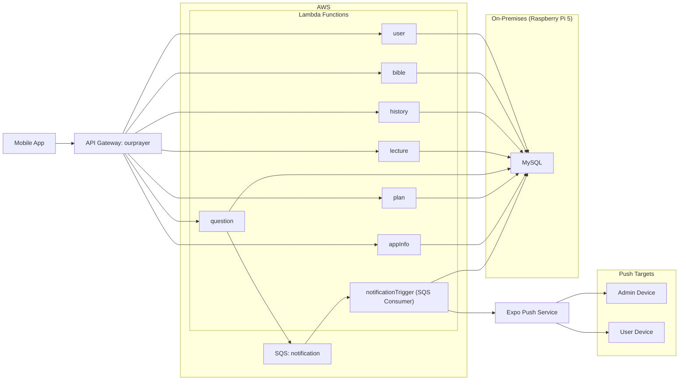
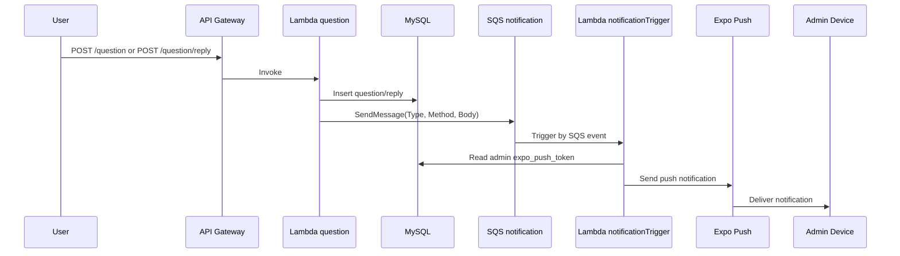

# "우리의 기도" 서버

우리의 기도 앱의 백엔드 서버입니다.

- 운영 기간: 2025.02 ~ 운영 중
- MAU: 100+
- 주요 기술: AWS Serverless, Node.js 22, MySQL, SQS, Expo Push
- ios : https://apple.co/4qQupBh
- andorid : http://bit.ly/49RsfLu

## 1. 프로젝트 개요

모바일 앱의 핵심 사용자 흐름(인증, 플랜/강의 조회, 기도 기록, 질문/답변)을 안정적으로 제공하는 서버를 설계하고 운영했습니다.

서버 아키텍처는 AWS Serverless(API Gateway + Lambda + SQS)를 채택했습니다. 
1인 개발 특성상 서버 증설, 런타임 운영, 장애 대응 같은 클라우드 인프라 관리 부담이 크기 때문에, 인프라 운영 포인트를 줄이고 기능 개발에 집중할 수 있는 구조를 우선 선택했습니다.

주요 기능:
- 사용자 인증 및 세션 관리
- 기도 플랜/강의/오디오 조회
- 기도 기록 저장 및 상세 조회
- 질문/답변 기능과 관리자 푸시 알림

## 2. 시스템 아키텍처

### 2.1 구성 요약

- API Gateway: `ourprayer` 1개
- Lambda Function: 8개
  - `user`, `bible`, `history`, `lecture`, `question`, `plan`, `appInfo`, `notificationTrigger`
- Lambda Layer: 2개
  - `jwt`, `mysql2`
- Queue: SQS `notification` 1개
- Runtime: `nodejs22.x`, `arm64`
- API 엔드포인트: 30개

관련 코드 위치:
- `template.yml`

### 2.2 아키텍처 다이어그램

레이어는 선 연결 대신 매핑 표로 정리했습니다.

| Layer | 적용 Function |
| --- | --- |
| `jwt` | `user`, `bible`, `history`, `lecture`, `question`, `plan`, `appInfo`, `notificationTrigger` |
| `mysql2` | `user`, `bible`, `history`, `lecture`, `question`, `plan`, `appInfo`, `notificationTrigger` |

### 2.3 질문/답변 알림 시퀀스

현재 `question/reply` 워커 구현은 관리자(`role = 'admin'`) 토큰 대상으로 동작합니다.

관련 코드 위치:
- `function/question/question.ts`
- `function/question/reply.ts`
- `function/notificationTrigger/handler.ts`
- `function/notificationTrigger/pushServer.ts`

## 3. 비용 절감 인프라 진화

운영 비용을 줄이기 위해 인프라를 단계적으로 전환했습니다.

`RDS -> EC2 + Docker + MySQL -> 온프레미스 (Raspberry Pi 5) + MySQL`

### 3.1 전환 타임라인

1. 1단계: RDS
2. 2단계: EC2 + Docker + MySQL
3. 3단계: 온프레미스 (Raspberry Pi 5) + MySQL

### 3.2 AWS 클라우드 월평균 비용 비교 (KRW/일)

| 단계 | 월평균 비용($) | 직전 단계 대비 증감 | 전환 이유 | 블로그
| --- | --- | --- | --- | --- |
| (AWS) RDS + Lambda + SQS + S3 | 26.67 | - | - | - |
| (AWS) EC2(MySQL) + Lambda + SQS + S3 | 16.12 | -10.55 USD(약 -39.6%) | DB 운영비 절감 시도 | 👉 [AWS 클라우드 비용 36% 줄였던 경험](https://medium.com/@ehdrbdndns/aws-%ED%81%B4%EB%9D%BC%EC%9A%B0%EB%93%9C-%EB%B9%84%EC%9A%A9-36-%EC%A4%84%EC%9D%B4%EA%B8%B0-free-tier-%EC%A2%85%EB%A3%8C-%ED%9B%84-rds%EB%A5%BC-ec2-docker-mysql%EB%A1%9C-%EC%98%AE%EA%B8%B0%EA%B8%B0-418b9f7c1011) |
| (온프레미스 - Raspberry Pi 5) MySQL, (AWS) Lambda + SQS + S3 | 0.1 | -16.02 USD(약 -99%) | DB 운영비 절감 시도 | - | 

## 4. 핵심 구현 딥다이브

### 4.1 인증 및 토큰 재발급

핵심 동작:
1. 회원 등록 시 `user`, `user_state`, `refresh_token`를 트랜잭션으로 생성
2. Access Token 만료시간은 `1h`
3. 보호 API에서 Access Token 검증 실패 시 Refresh Token으로 재발급 시도
4. 재발급 성공 시 `401` 응답에 새 `accessToken` 포함

관련 코드 위치:
- `function/user/auth/register.ts`
- `layer/jwt/customJwt/index.ts`
- `function/user/user.ts`

### 4.2 질문/답변 비동기 알림 파이프라인

핵심 동작:
1. 질문/답변 생성 후 SQS 메시지 발행
2. 메시지 속성 `Type(question|reply)`, `Method(insert)` 사용
3. `notificationTrigger`가 SQS 이벤트를 소비
4. 관리자 `expo_push_token` 조회 후 Expo Push 발송

관련 코드 위치:
- `function/question/question.ts`
- `function/question/reply.ts`
- `function/notificationTrigger/handler.ts`
- `function/notificationTrigger/question.ts`
- `function/notificationTrigger/reply.ts`
- `function/notificationTrigger/pushServer.ts`

### 4.3 플랜/강의/오디오/기록 조회 모델

핵심 동작:
1. `/plan`에서 플랜 목록과 최근 기도 이력 기반 `currentPlan` 제공
2. `/lecture/audio`에서 강의별 오디오를 그룹화해 반환
3. `/history`, `/history/detail`에서 기도 기록 CRUD/상세 조회 제공

관련 코드 위치:
- `function/plan/plan.tsx`
- `function/lecture/lectureAudio.ts`
- `function/history/history.ts`
- `function/history/detail.ts`

## 5. 데이터 모델 (ERD)

핵심 테이블:
- `user`, `user_state`, `refresh_token`
- `question`, `question_reply`
- `plan`, `lecture`
- `prayer_history`

관계 요약:
- `user` 1:1 `user_state`
- `user` 1:N `refresh_token`
- `user` 1:N `question`
- `question` 1:N `question_reply`
- `plan` 1:N `lecture`
- `user` 1:N `prayer_history`, `lecture` 1:N `prayer_history`

👉 [ERD 설계도(전체 관계도)](https://www.erdcloud.com/d/TsdFZ6aDmT3tK9eBx)

## 6. 참고 코드 인덱스

- 인프라/엔드포인트 정의: `template.yml`
- 배포/빌드 설정: `samconfig.toml`
- 인증 계층: `layer/jwt/customJwt/index.ts`
- DB 계층: `layer/mysql2/customMysql/index.ts`
- 질문/답변 + SQS 발행: `function/question/question.ts`, `function/question/reply.ts`
- SQS 소비 + Push 발송: `function/notificationTrigger/handler.ts`, `function/notificationTrigger/pushServer.ts`
- 플랜/강의/기록: `function/plan/plan.tsx`, `function/lecture/lectureAudio.ts`, `function/history/history.ts`
